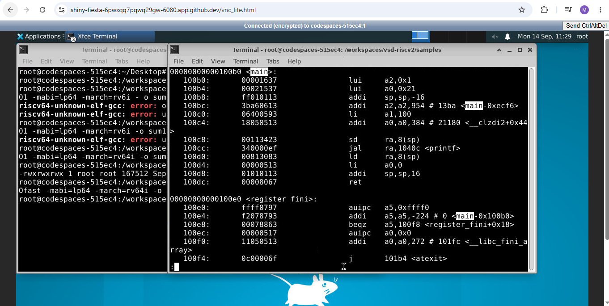
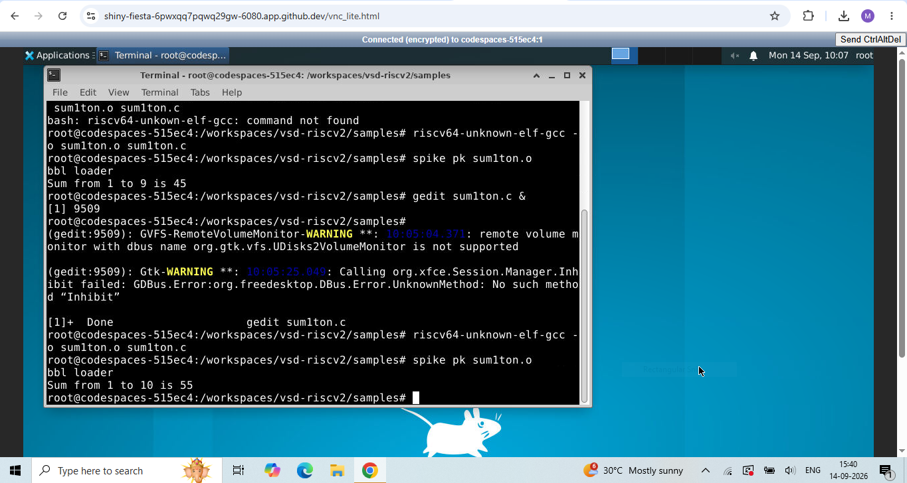
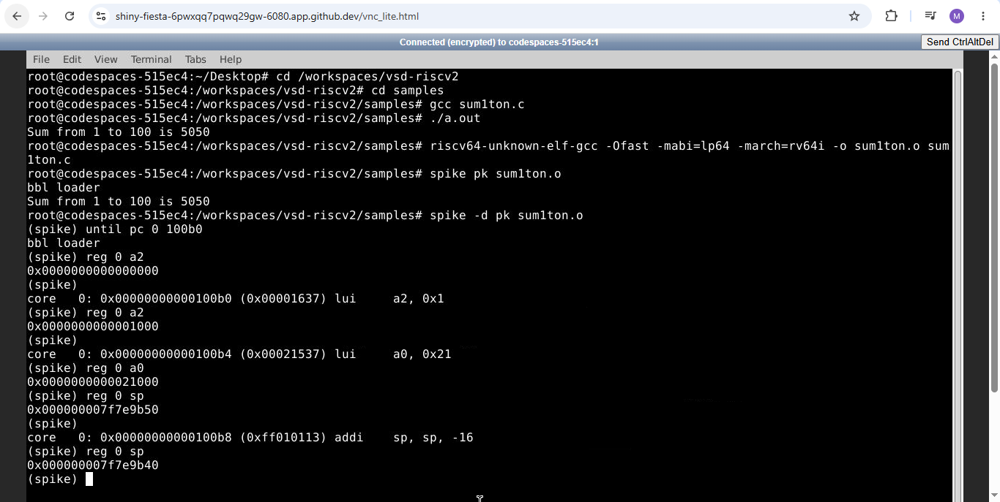
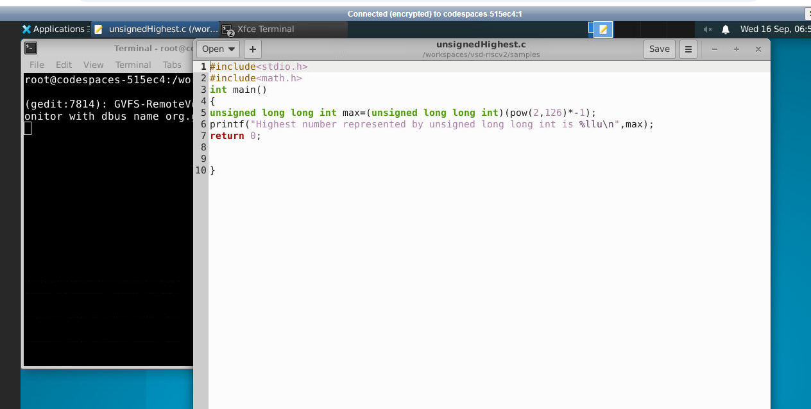
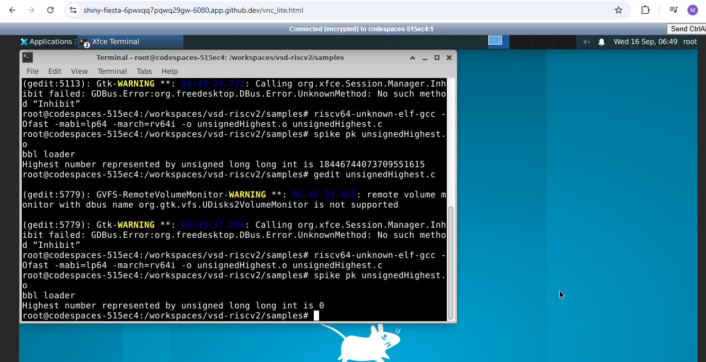
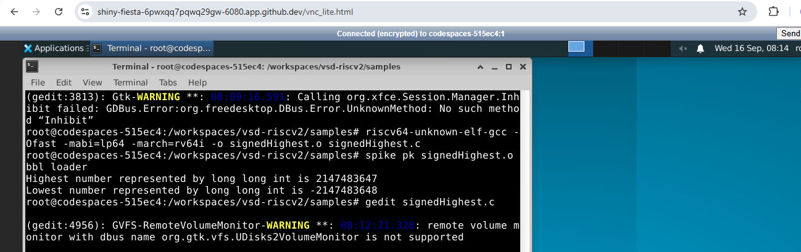
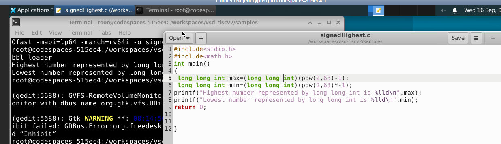
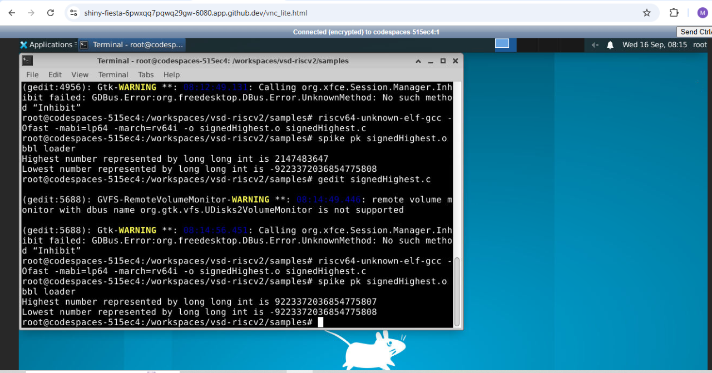

# RISC-V MYTH Workshop

The **RISC-V MYTH workshop** stands for **"Microprocessor for You in Thirty Hours."**

Its central goal is to understand the complete journey from:

**C Code → RISC-V Instructions → CPU Datapath & Control → Your Own Pipelined RISC-V Processor**

---

## What Actually Happens Between C Code and Hardware Execution?

The following flow shows the different layers involved in executing a program:

```text
Application Software
        ↓
System Software
        ↓
High-Level Language
        ↓
Compiler
        ↓
Assembly Code
        ↓
Assembler
        ↓
Machine Code
        ↓
Hardware
```

---

## Applications

Applications are the programs that users actually want to accomplish something with.

**Examples:** Chrome, VirtualBox

Higher-level languages like C, C++, Python, etc. are used to build these applications.

---

## System Software

This is the layer between applications and the hardware.

The OS provides services that applications need, such as:

- Handling I/O operations
- Managing memory and deciding which parts of memory can be used by different programs
- Low-level system functions like file access, memory management, process management, networking, device management, and security

---

## Compiler

A compiler converts a higher-level programming language into lower-level instructions that a processor can execute.

The RISC-V GCC compiler takes a C program and produces RISC-V code.

For example, in C:

int c = a + b;

gets mapped to:

add a1, a2, a3

`riscv64-unknown-elf-gcc` tells GCC that you're generating code for a RISC-V target, rather than for the x86 CPU running your Codespace. That's why it's called a **cross-compiler**.

---

## Assembly Language

Assembly language is basically a human-readable representation of processor instructions.

Assembly is much closer to the hardware than C is.

---

## Assembler

The assembler converts assembly language into machine code.

---

## Hardware

The hardware actually executes the instructions.

As per the above example, when the CPU receives `add a1, a2, a3`, the instruction goes to the instruction decoder, and the ALU performs the addition of the values stored in `a2` and `a3`, and stores it in `a1`.

---

## Instruction Set Architecture (ISA)

An ISA defines the interface between software and the processor.

**RISC-V is an ISA.**

It defines things such as:

- Instructions like `ADD`, `SUB`, `AND`, `OR`, `LW`, etc.
- Registers such as `x0`, `x1`, ...
- Instruction formats
- Memory behavior (how instructions interact with memory)
- Privilege architecture

---

## Setup

Follow the instructions mentioned at https://github.com/vsdip/vsd-riscv2 to set up the Codespace.

The program to compute the sum from 1 to n is compiled using both the GCC compiler and the RISC-V compiler.

For normal GCC compilation, simply `gcc filename.c` is sufficient in the terminal, and `./a.out` is used to view the output.

### C Program

#include<stdio.h>
#include<math.h>
int main()
{
    int sum = 0;

    for (int i = 1; i <= 10; i++)
        sum = sum + i;

    return sum;
}


---

## Compiling for the RISC-V Compiler

The command used is:

riscv64-unknown-elf-gcc -Ofast -mabi=lp64 -march=rv64i -o filename.o filename.c

- **-Ofast** — compiler optimization for speed
- **-mabi** — which Application Binary Interface should the generated program follow
- **lp64** — long is 64-bit :: pointer is 64-bit :: long long is 64-bit
- **-march** — which RISC-V architecture/instruction set should GCC generate
- **rv64i** — RISC-V 64-bit base integer ISA

The **I** represents the base integer instruction set, which includes `ADD`, `SUB`, `AND`, `OR`, `XOR`, `LW`, etc.

---

## Disassembly

To disassemble the object file:

riscv64-unknown-elf-objdump -d filename.o | less

Disassembly converts machine code back into readable assembly instructions.



---

## Spike Simulator

**Spike** is a RISC-V ISA simulator. Spike is a software program that behaves like a RISC-V CPU.

So Spike acts as a virtual RISC-V processor when one doesn't necessarily have a physical RISC-V CPU available.

spike pk filename.o

- **spike** — RISC-V ISA simulator
- **pk** — RISC-V proxy kernel
- **filename** — our RISC-V program



`spike -d pk object filename.o` can be used to set the PC from where we want to run the instructions step by step.

**Commands:**

until pc 0 <memory location>
reg 0 <register name>


---

## Number Representation

A bit can represent logic levels 0 or 1. 8 bits form a byte. 32 bits form a word. 64 bits form a double word.

Unsigned numbers can represent positive numbers and zero only. The range is from 0 to 2^n - 1, where n is the number of bits.

To be able to represent negative numbers, signed numbers are used, whose MSB represents the sign — 0 being positive and 1 being negative.

**2's complement** representation is used to represent negative numbers.

The range of positive and negative numbers in RISC-V is:

- Positive numbers: 0 to 2^63 - 1
- Negative numbers: -1 to -2^63




If only `int` is mentioned, it is treated as 32-bit and can lead to issues, so `long long int` must be used for 64-bit.

### Incorrect Usage



### Corrected Version



