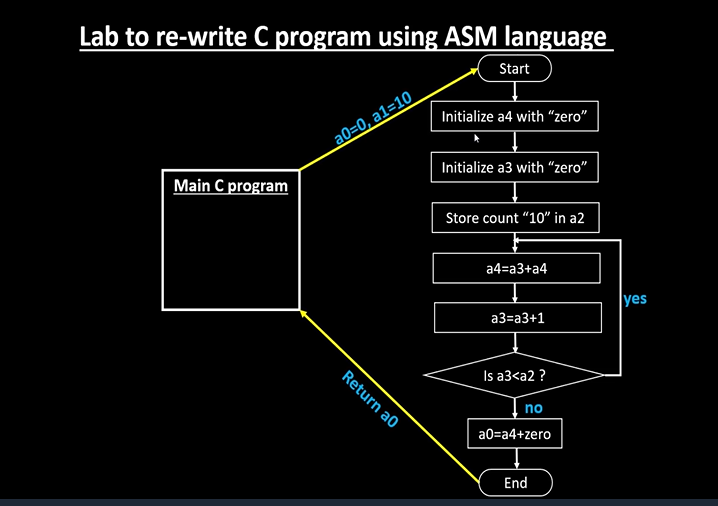
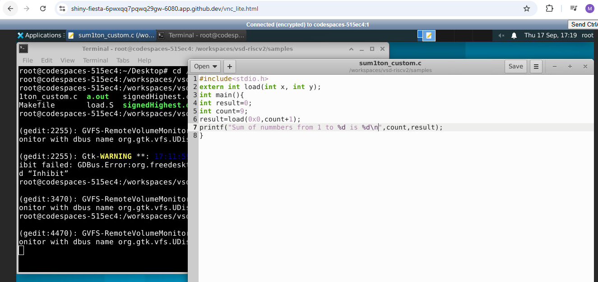
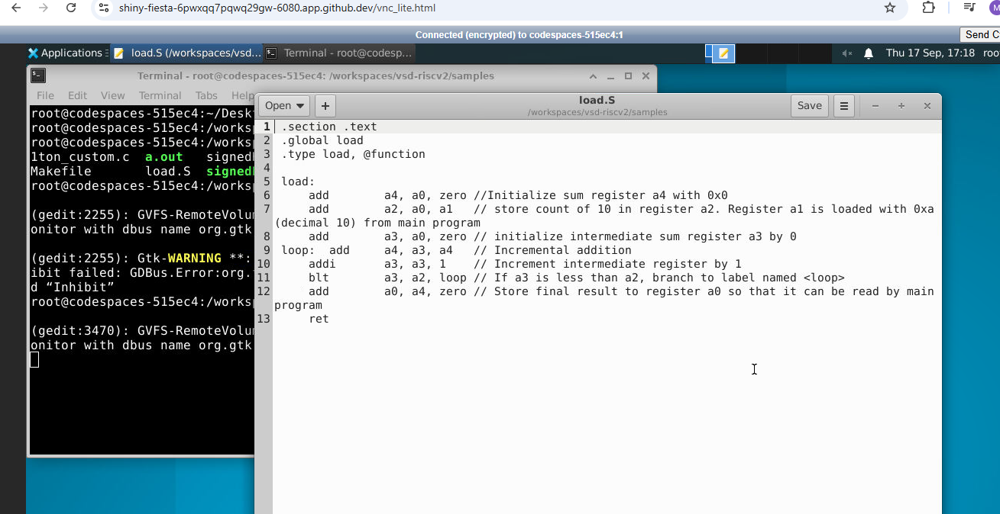
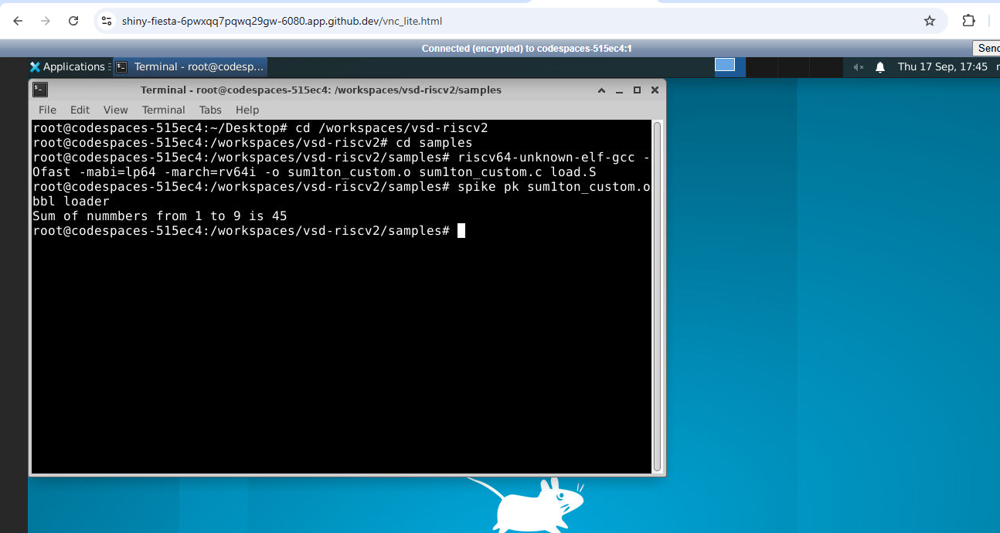
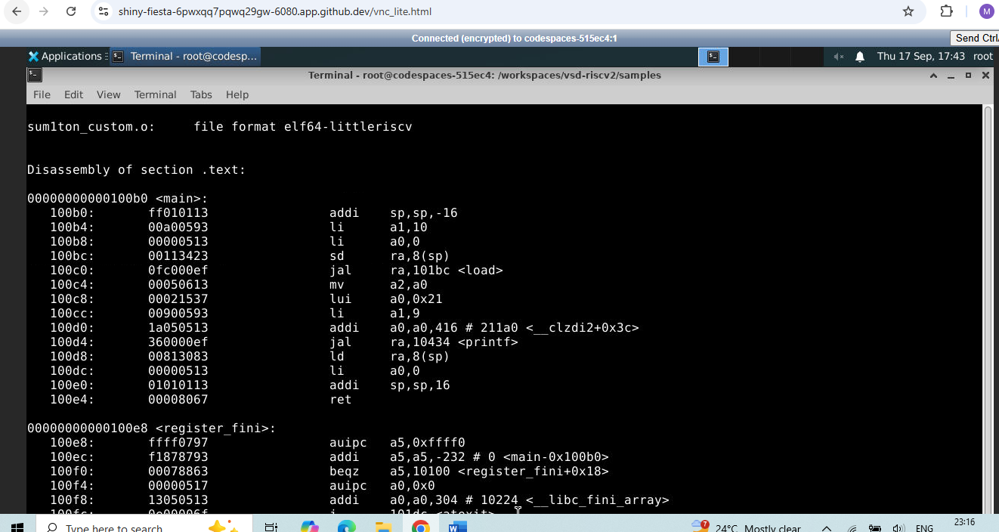
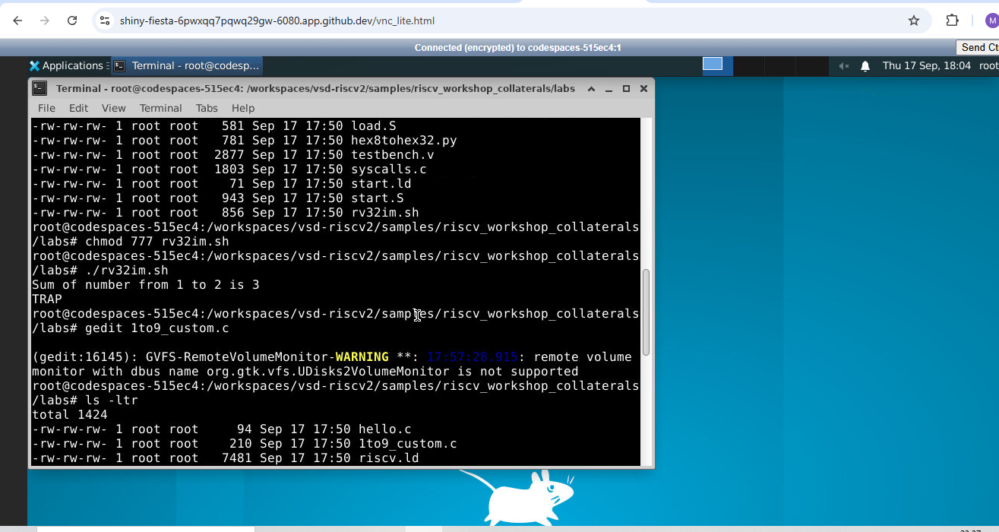

## ABI (Application Binary Interface)

Application Binary Interface is an interface which allows application programs, like Email, to access hardware resources directly.

The role of ABI can be understood by the following flowchart:

┌─────────────────────┐
│ Application         │
│ Email, Browser etc. │
└──────────┬──────────┘
           ↓
┌─────────────────────┐
│ API                 │
│ "How software asks  │
│  for functionality" │
└──────────┬──────────┘
           ↓
┌─────────────────────┐
│ Standard Libraries   │
│ printf(), etc.      │
└──────────┬──────────┘
           ↓
┌─────────────────────┐
│ System Call         │
└──────────┬──────────┘
           ↓
┌─────────────────────┐
│ ABI                 │
│ "Rules for binary   │
│  communication"     │
└──────────┬──────────┘
           ↓
┌─────────────────────┐
│ RISC-V ISA          │
│ ADD, SUB, LW, SW... │
└──────────┬──────────┘
           ↓
┌─────────────────────┐
│ Machine Code        │
│ 010101010...        │
└──────────┬──────────┘
           ↓
┌─────────────────────┐
│ RTL                 │
│ CPU design          │
└──────────┬──────────┘
           ↓
┌─────────────────────┐
│ Hardware            │
│ Actual processor    │
└─────────────────────┘

---

## Registers and the ABI

ABI also defines the role of registers.

RISC-V has 32 registers, ranging from `x0` to `x31`. The reason for the total number of registers to be 32 is because the length of the register field in a RISC-V instruction is 5 bits. So, the maximum number of registers is `2^5 = 32`.

The length of the registers is 32-bit for RV32 and 64-bit for RV64.

The conventional purposes of the registers, as defined by ABI, is as follows:

.png)

---

## Memory Addressing and Load/Store

A double word is stored as 8 bytes. RISC-V follows little-endian memory addressing, wherein the lowest byte goes to the lowest memory address and the highest byte goes to the highest memory address. Since registers are limited in number, memory is often used to store data.

To illustrate loading data from memory, an example instruction is:

ld x8, 16(x23)

Here, `ld` stands for load double word, `x8` is the destination register, `16` is the offset, and `x23` is the source register. 8 bytes of data from the location of `x23`'s content + 16 is loaded into `x8`.

In RISC-V, the opcode is a fixed 7-bit field located at the lowest bits (bits 6–0) of an instruction. It tells the processor the general family or type of operation to perform.

- For the LOAD instruction, the effective opcode is `opcode + funct3`
- For ADD, the effective opcode is `opcode + funct3 + funct7`

For addition:

add x8, x24, x8

`x8` is the destination register, which should store `x8 + x24` (source registers).

For storing data back to memory:

sd x8, 8(x23)

`sd` stands for store double word, `x8` is the data register, `8` is the offset, and `x23` is the source register. 8 bytes of data from the location of `x8` is stored into the memory location pointed to by `x23`'s content + 8.

---

## Instruction Formats

**R-type instructions** primarily operate on registers. Example: `ADD`, `SUB`, etc.

Format: `funct7 | rs2 | rs1 | funct3 | rd | opcode`

**I-type instructions** primarily operate on registers and an immediate value. Example: `ADDI`

Format: `immediate | rs1 | funct3 | rd | opcode`

**S-type instructions** are primarily used for store instructions.

Format: `imm[11:5] | rs2 | rs1 | funct3 | imm[4:0] | opcode`

---

## Sum from 1 to N in Assembly

The C program to compute the sum from 1 to N is re-written using ASM language.

Arguments are passed using the `a0` and `a1` registers. The final result is returned through the `a0` register.

The flowchart implements a simple sum calculation from 0 to 9 using RISC-V registers.

- `a4` is initialized to 0 and stores the running sum.
- `a3` is initialized to 0 and acts as the counter, while `a2` stores the limit 10.
- `a4 = a3 + a4` adds the current counter to the sum, and `a3 = a3 + 1` increments the counter.
- The loop continues as long as `a3 < a2`.
- When the loop ends, the final sum 45 is copied to `a0` and returned.

The overall flow can be summarised as:

C program
   ↓
load(0, 10)
   ↓
a0 = 0, a1 = 10
   ↓
Assembly function
   ↓
a4 = running sum
a3 = counter
a2 = limit
   ↓
0 + 1 + 2 + ... + 9
   ↓
a4 = 45
   ↓
a0 = 45
   ↓
return to C
   ↓
result = 45

---

## Running the Custom Assembly Program

Commands:

riscv64-unknown-elf-gcc -Ofast -mabi=lp64 -march=rv64i -o filename.o filename.c load.S
spike filename.o

**Object dump output:**

---

## Executing on the Actual RISC-V CPU

Commands:

git clone https://github.com/kunalg123/riscv_workshop_collaterals.git
cd riscv_workshop_collaterals
cd labs
chmod 777 rv32im.sh
./rv32im.sh

These hex files are hexadecimal representations of machine instructions/data.

`firmware32.hex` is a memory initialization file containing the machine code/data generated from the RISC-V program, formatted as 32-bit hexadecimal words, so that the Verilog RISC-V CPU can load and execute it.

**Overall flow:**

C/Assembly → .o → ELF → HEX → 32-bit HEX → CPU Memory → Simulation
