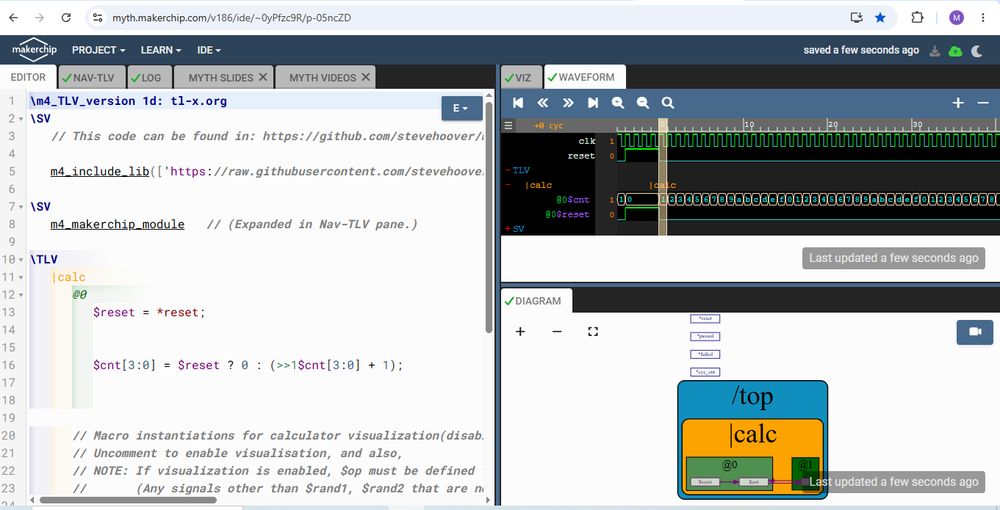
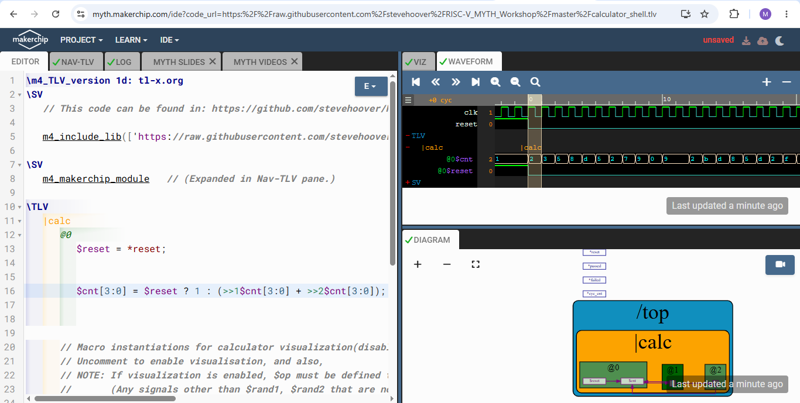
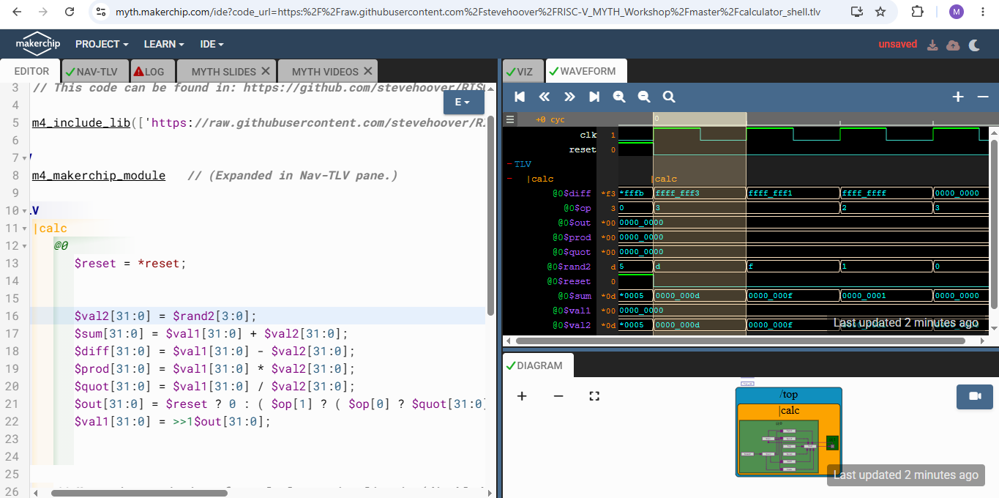
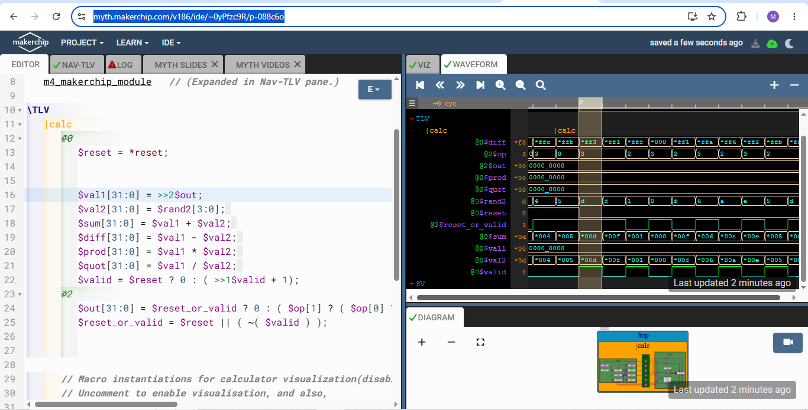
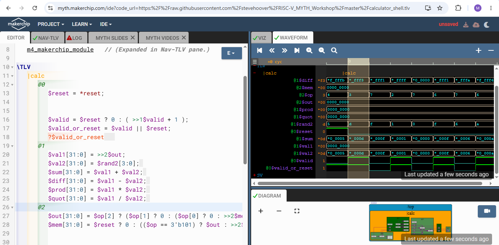
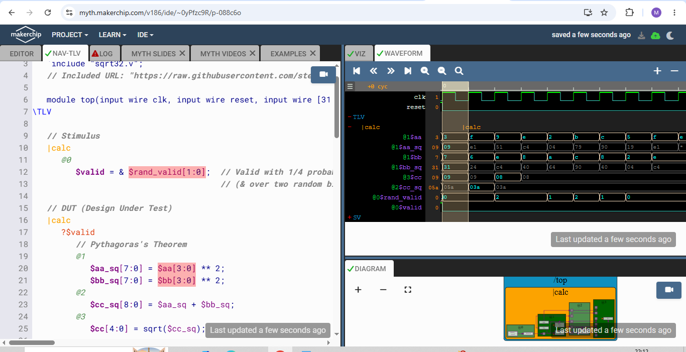

## TL-Verilog & Makerchip

The main progression is:

```text
Logic Gates → Combinational Logic → Sequential Logic → State →
Pipelining → TL-Verilog → CPU design
```

---

## 1. Logic Gates

Basic gates used to build digital circuits:

- **NOT:** `!A`
- **AND:** `A & B`
- **OR:** `A | B`
- **XOR:** `A ^ B`
- **NAND:** `!(A & B)`
- **NOR:** `!(A | B)`
- **XNOR:** `!(A ^ B)`

A **MUX** (multiplexer) selects one input based on a select signal:

```verilog
assign out = sel ? in1 : in2;
```

`in1` is selected if `sel` is 1, else `in2` is selected.

---

## 2. Combinational Logic

Combinational logic has no memory. The output depends only on the current inputs — output changes accordingly as the input changes.

**Examples:** Adders, MUXes, Calculators, Logic gates

In TL-Verilog, signals can be written directly:

```tlverilog
$out = $in1 + $in2;
```

Vectors can be declared with widths such as:

```tlverilog
$out[31:0] = $in1[31:0] + $in2[31:0];
```

---

## 3. Sequential Logic

Sequential logic stores state and is controlled by a clock.

A flip-flop captures the next state on a clock edge. Reset puts the circuit into a known initial state.

---

## 4. Fibonacci Example

Fibonacci series to demonstrate sequential logic. The next value is the sum of the previous two:

```text
1, 1, 2, 3, 5, 8, 13, ...
```

The slide uses:

```tlverilog
$num[31:0] = $reset ? 1 : (>>1$num + >>2$num);
```

`>>1$num` means the value from one stage/cycle earlier, while `>>2$num` means two stages/cycles earlier.

For a counter:

```tlverilog
$cnt[3:0] = $reset ? 0 : (>>1$cnt[3:0] + 1);
```

This gives `0 → 1 → 2 → 3 → 4 → ...` after reset.

---

## 5. Pipelining

A pipeline divides a long computation into stages.

**Example:**

```text
Stage 1       Stage 2       Stage 3
a², b²   →   a²+b²     →   sqrt()
```

Pipeline registers separate the stages. The major benefit is higher throughput: once the pipeline is full, new inputs can be processed regularly.

---

## 6. TL-Verilog Timing Abstraction

TL-Verilog lets timing be expressed using pipeline stages:

```tlverilog
|calc
  @1
    $aa_sq = $aa * $aa;
    $bb_sq = $bb * $bb;
  @2
    $cc_sq = $aa_sq + $bb_sq;
  @3
    $cc = sqrt($cc_sq);
```

The `@1`, `@2`, and `@3` indicate pipeline stages.

A major advantage is that retiming can be changed without manually rewriting large amounts of flip-flop logic. We can move pipeline boundaries without changing what the circuit computes, to make the circuit run at a higher clock frequency.

---

## 7. Identifiers

TL-Verilog uses naming conventions:

- `$lower_case` → pipe signal
- `$CamelCase` → state signal
- `$UPPER_CASE` → keyword signal
- `>>1` → one stage/cycle ahead

Names also follow TL-Verilog token/delimitation rules.

---

## 8. Validity

Validity indicates whether a pipeline value is meaningful.

```tlverilog
$valid = ...;
?$valid
```

Validity helps with:

- Debugging
- Error checking
- Cleaner pipelines
- Clock gating

Instead of calculating on every cycle, the design can indicate which cycles contain valid data.

---

## 9. Clock Gating

Clock signals normally reach every flip-flop and toggle every cycle.

Clock gating prevents unnecessary clock activity when logic does not need to operate, reducing power consumption. TL-Verilog can generate fine-grained gating/enables.

---

## 10. Hierarchy

TL-Verilog supports hierarchical designs using scopes such as:

```tlverilog
|default
   /yy[*]
      /xx[*]
```

This allows repeated structures and hierarchical organization of hardware. Lexical re-entrance is also introduced, which allows signals from other hierarchical contexts to be referenced.

---

## Makerchip Examples

**Combinational Calculator**


https://myth.makerchip.com/v186/ide/~0yPfzc9R/p-04mcBP

**Counter**



https://myth.makerchip.com/v186/ide/~0yPfzc9R/p-05ncZD

**Fibonacci**



https://myth.makerchip.com/v186/ide/~0yPfzc9R/p-06ocrK

**Sequential Calculator**



https://myth.makerchip.com/v186/ide/~0yPfzc9R/p-078cA5

**Cycle Calculator**



https://myth.makerchip.com/v186/ide/~0yPfzc9R/p-088c6o

**Mem Recall Calculator**



https://myth.makerchip.com/v186/ide/~0yPfzc9R/p-096ckl

**Pythagoras theorem**


