## Building a RISC-V Core

The CPU datapath introduced contains the PC, instruction memory, decoder, register file, ALU and data memory.

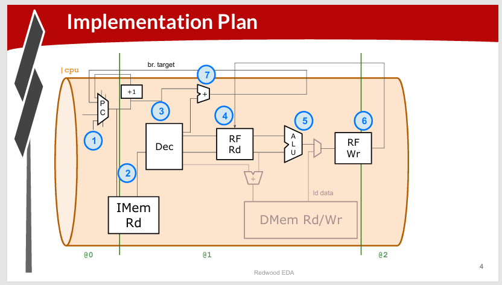

Slide 4 divides the processor into timing stages:

```text
@0          @1          @2
PC/Fetch    Decode      Execute/Write
```


---

## 3. RISC-V Shell Code

The starting-point code contains:

- A simple RISC-V assembler
- Instruction memory containing the sum 1..9 test program
- Commented register-file and memory code
- Visualization

---

## 4. Next PC

The first CPU component is the Program Counter (PC).

The slide specifies that `$pc[31:0]` is reset to 0 and then incremented by one instruction, which is 4 bytes.

Conceptually:

```text
reset → PC = 0
then  → PC = PC + 4

0, 4, 8, 12, ...
```

---

## 5. Fetch

The processor adds the supplied instruction memory containing the test program.

The instruction-memory interface has:

```tlverilog
$imem_rd_en
$imem_rd_addr
$imem_rd_data[31:0]
```

The instruction is read using the PC address and stored in:

```tlverilog
$instr[31:0]
```

The slide specifies the PC address as:

```tlverilog
$pc[M4_IMEM_INDEX_CNT+1:2]
```

and enable reads every cycle after reset.

---

## 6. Instruction Decode

The CPU must determine what kind of instruction it has fetched.

The workshop uses:

```tlverilog
instr[6:2]
```

to determine the instruction type: `I`, `R`, `S`, `B`, `J`, `U`

Signals such as:

```tlverilog
$is_i_instr
```

identify the instruction type.

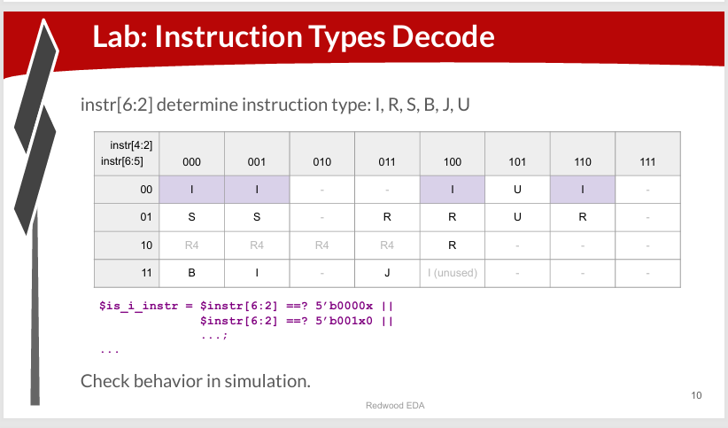

---

## 7. Immediate Decode

Different RISC-V instruction formats place immediate bits in different locations. The CPU therefore forms one common:

```tlverilog
$imm[31:0]
```

The slide shows the immediate layouts for:

- I-type
- S-type
- B-type
- U-type
- J-type

For I-type, the slide shows sign extension of the immediate using `instr[31]`.

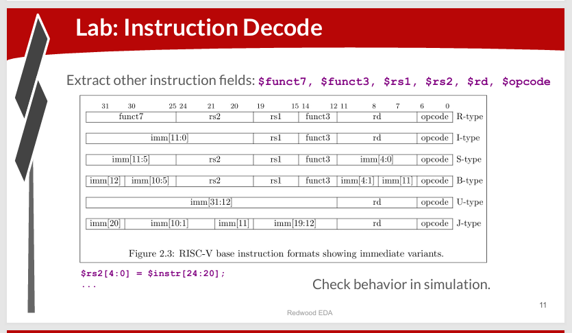

---

## 8. Instruction Fields

The decoder extracts:

- `funct7`
- `funct3`
- `rs1`
- `rs2`
- `rd`
- `opcode`

### When Conditions

A validity condition is used:

```tlverilog
$rs2_valid = $is_r_instr || $is_s_instr || $is_b_instr;

?$rs2_valid
    $rs2[4:0] = $instr[24:20];
```

The assignment is active only when `$rs2_valid` is true.

---

## 9. RV32I Instruction Decode

The decoder begins recognizing the RV32I base instruction set.

The slide combines:

```tlverilog
$dec_bits[10:0] = {$funct7[5], $funct3, $opcode};
```

and then compares those bits to identify instructions such as `BEQ` and `ADD`.

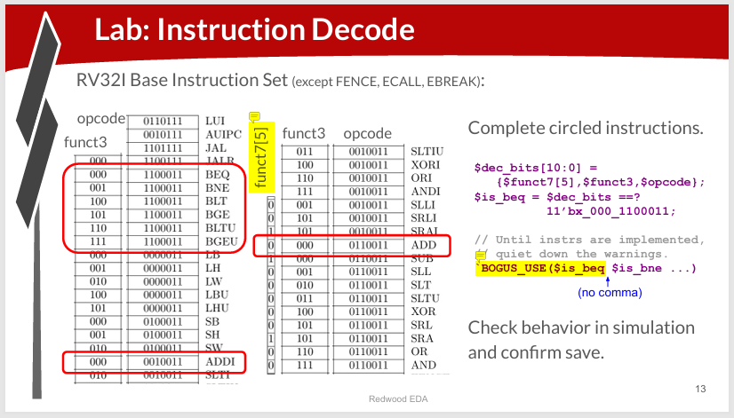

---

## 10. Register File Read

The register file has:

- 2 read ports
- 1 write port

The next step connects the register-file outputs to:

```tlverilog
$src1_value[31:0]
$src2_value[31:0]
```

These values become ALU inputs.

---

## 11. ALU

The ALU performs arithmetic and logic. The result is stored in:

```tlverilog
$result[31:0]
```


---

## 12. Register File Write

The ALU result must be written back to the destination register `$rd` when `$rd_valid` is true.

There is one critical RISC-V rule: **`x0` is always zero.**

Therefore, writes to register 0 must be disabled.

---

## 13. Arrays

The interface contains signals such as:

```tlverilog
$reset
$wr_en
$wr_index
$wr_data
$rd_en
$rd_index
$rd_data
```

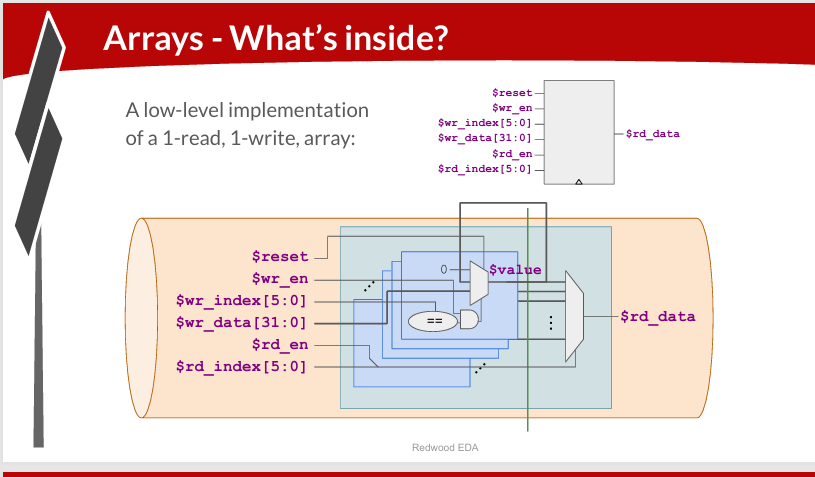

The diagram illustrates how stored values and selection logic can implement an array.

---

## 14. Register File — Detailed

The overall data path is:

```text
Instruction
    ↓
Decode
    ↓
Register File Read
    ↓
ALU
    ↓
Register File Write
```

---

## 15. Branches

The processor must determine whether a branch is taken. In RISC-V, a `JUMP` is unconditional, whereas a `BRANCH` is conditional — the branch is taken only if a certain condition is satisfied.

The branching instructions are as follows:

| Instruction | Condition |
|---|---|
| `BEQ` | `==` |
| `BNE` | `!=` |
| `BLT` | signed `<` |
| `BGE` | signed `>=` |
| `BLTU` | unsigned `<` |
| `BGEU` | unsigned `>=` |

---

## 16. Branch Target and PC Update

Target branch is given by:

```text
$br_tgt_pc = PC + immediate
```

Then the PC MUX is modified to use the previous branch target when the previous instruction took a branch.

The program should now calculate:

```text
1 + 2 + ... + 9 = 45
```

---

## 17. Testbench

**Lab: Testbench**

The testbench tells Makerchip when the simulation passes by checking register `x10`, which contains the sum.

The slide uses:

```tlverilog
*passed = |cpu/xreg[10]>>5$value == (1+2+3+4+5+6+7+8+9);
```

The expected value is:

```text
45
```

Makerchip should report a passed message when the condition becomes true.

---

## Overall Flow

```text
PC
 ↓
Instruction Memory
 ↓
Decode
 ↓
Register File Read
 ↓
ALU
 ↓
Register File Write
```

Branch logic feeds information back to the PC:

```text
Branch instruction
      ↓
Compare registers
      ↓
$taken_br
      ↓
Branch target
      ↓
PC MUX
      ↓
Next PC
```

---

## Labs

### PC — Program Counter

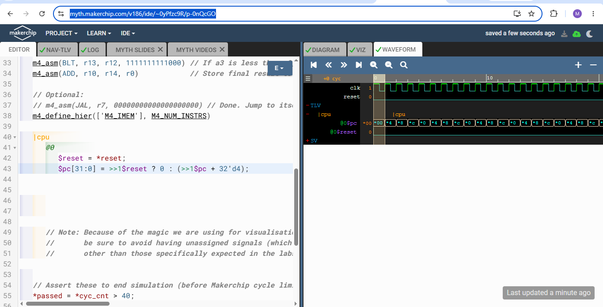

The program counter resets to 0 and advances by 4 bytes per instruction. PC advances as: `0 → 4 → 8 → 12 → ...`

### Instruction Memory

Connect the Program Counter to instruction memory.

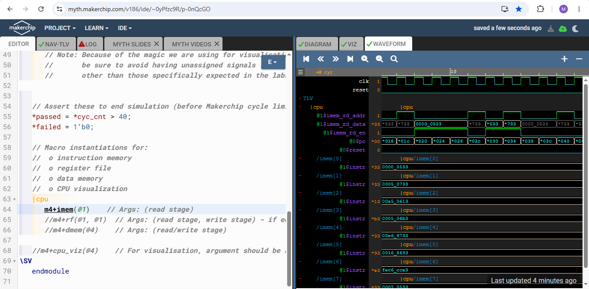

###  Instruction Fetch

Fetch the instruction corresponding to the current PC. The instruction memory address follows the PC, and `$instr` receives the corresponding 32-bit instruction from instruction memory.

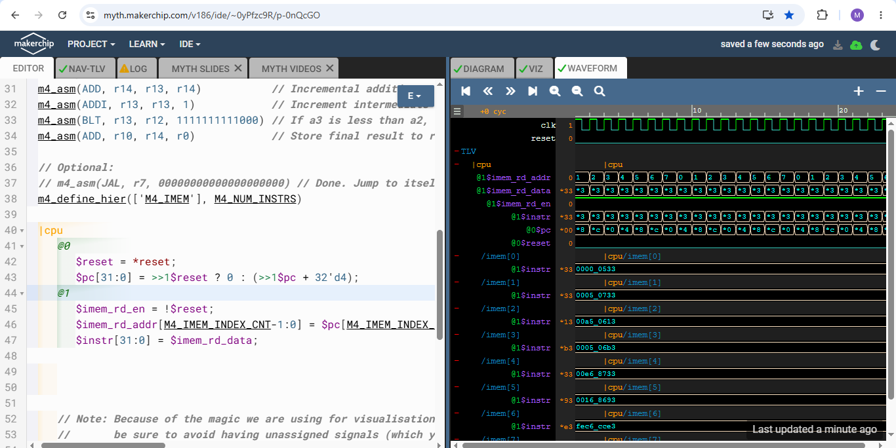

### Instruction Type Decode

Classify `$instr[6:2]` into the instruction types `I`, `R`, `S`, `B`, `J`, and `U`.
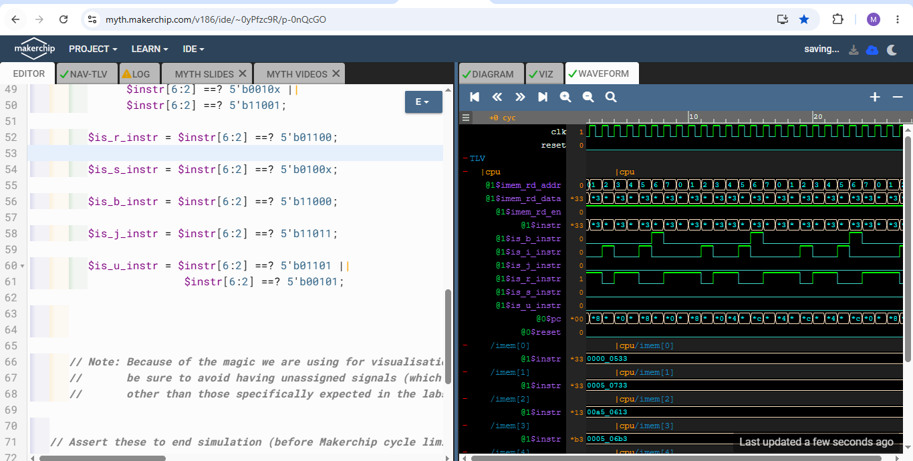

### Immediate Decode

The `$imm[31:0]` signal is generated from the appropriate instruction fields for I, S, B, U, and J-type instructions.
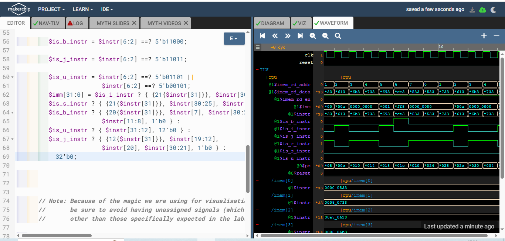

### Instruction Decode

Extract the fields required to decode a RISC-V instruction.


**Fields Decoded:**

- `funct7`
- `funct3`
- `rs1`
- `rs2`
- `rd`
- `opcode`
  
  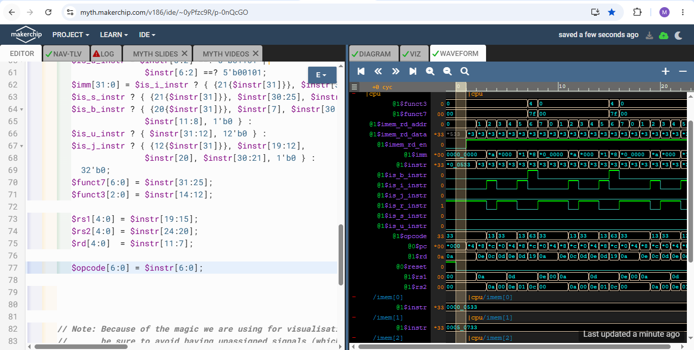

### Are rs1,rs2 and rd valid?

**Fields:**

- `$rs1_valid`
- `$rs2_valid`
- `$rd_valid`

The corresponding `rs1`, `rs2`, and `rd` fields are assigned only when they are valid for the instruction type. 
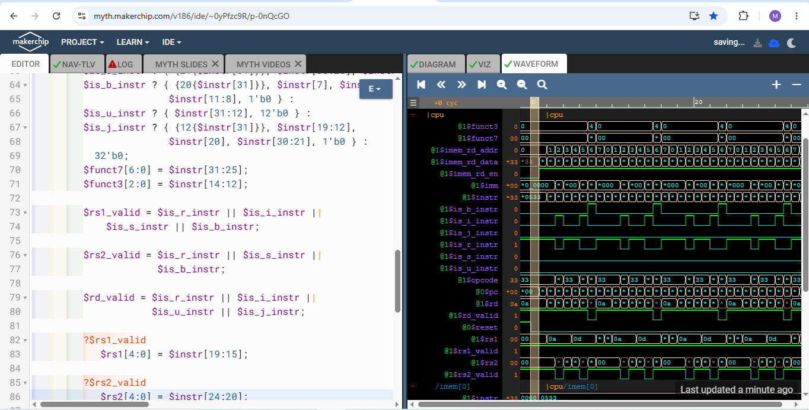

### Actual Instruction Decode

Decode the fetched RISC-V instruction and identify the specific instruction being executed.


**Instructions Decoded:**

- `BEQ`
- `BNE`
- `BLT`
- `BGE`
- `BLTU`
- `BGEU`
- `ADDI`
- `ADD`
- 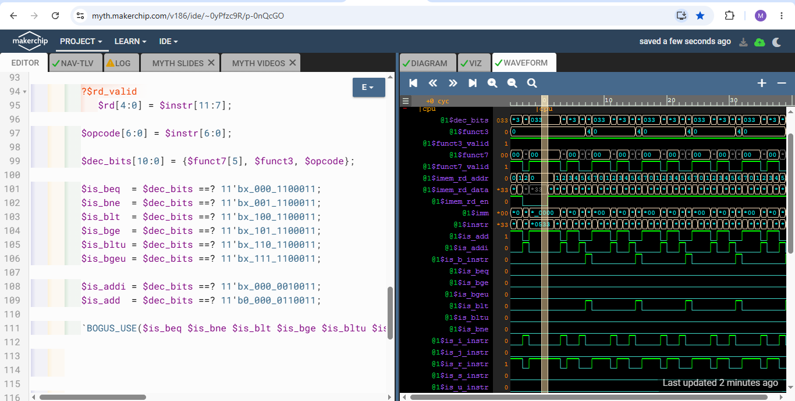

### Register File Read

Read the values of source registers `$rs1` and `$rs2` from the register file.
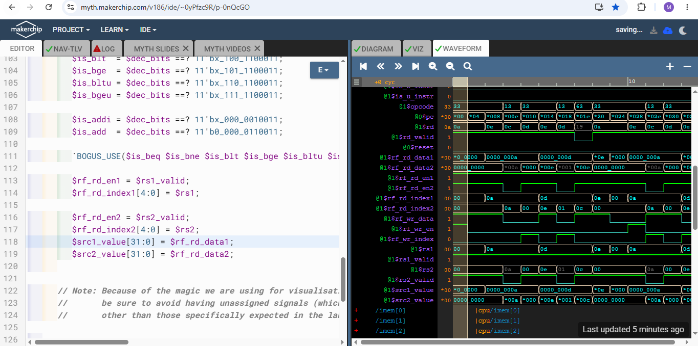

### ALU Operation

Make the ALU produce `$result` for `ADD` and `ADDI`.
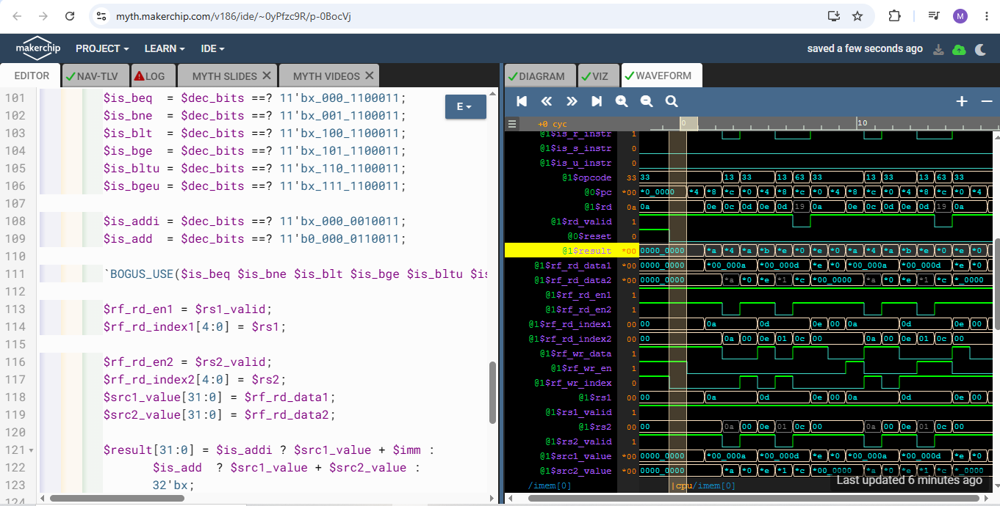

### Register File Write

Write `$result` into the destination register `$rd`, while making sure `x0` remains zero.
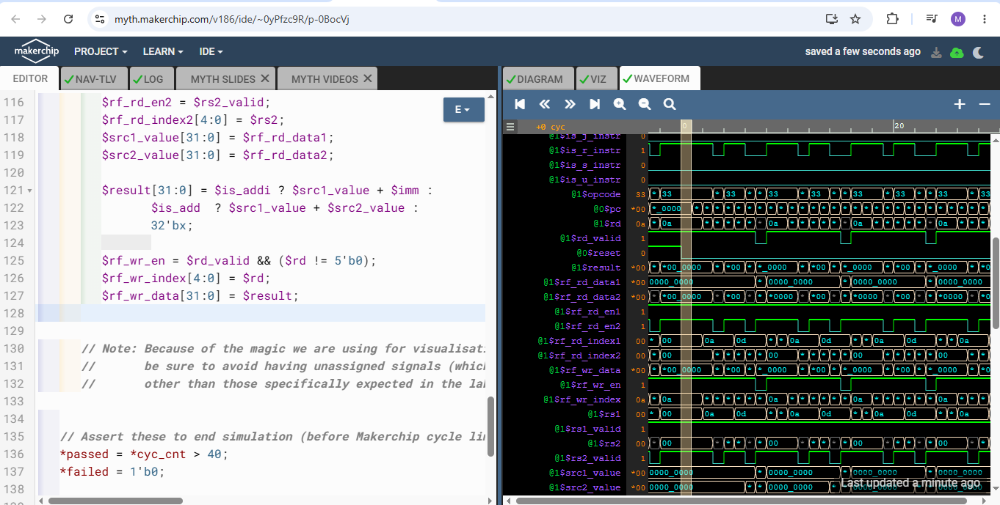

### Branch

Determine `$taken_br` from the branch type and register values. Calculate the branch target address, `$br_tgt_pc`. Change PC so that when the previous instruction took a branch, the PC jumps to the previous branch target.
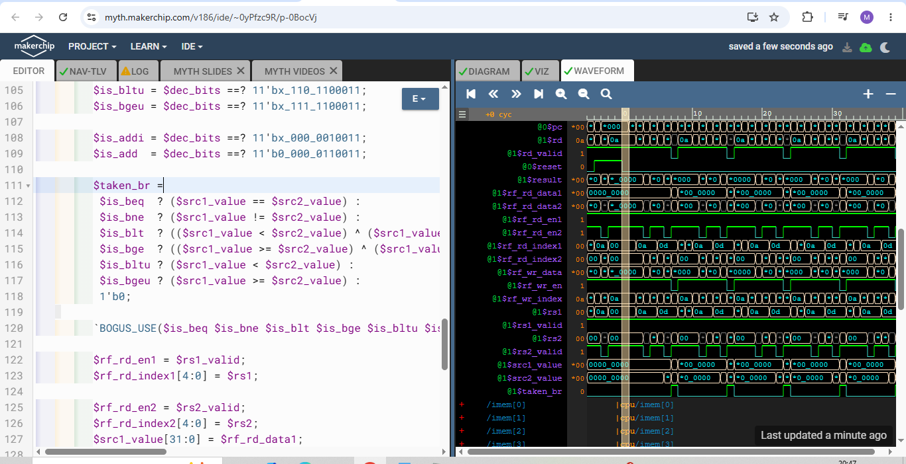
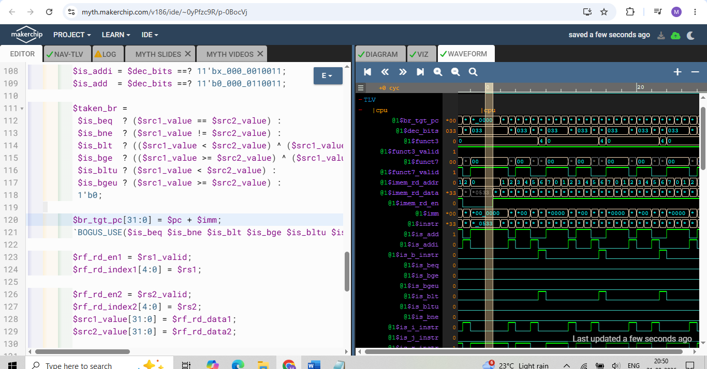
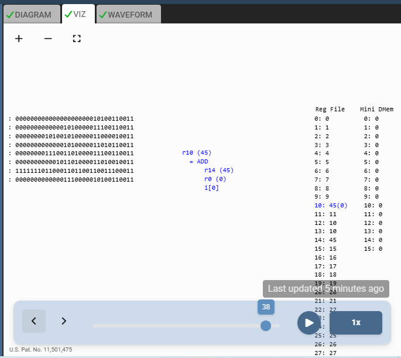

### Testbench 

Modify the testbench code to explicitly check `x10 == 45`.
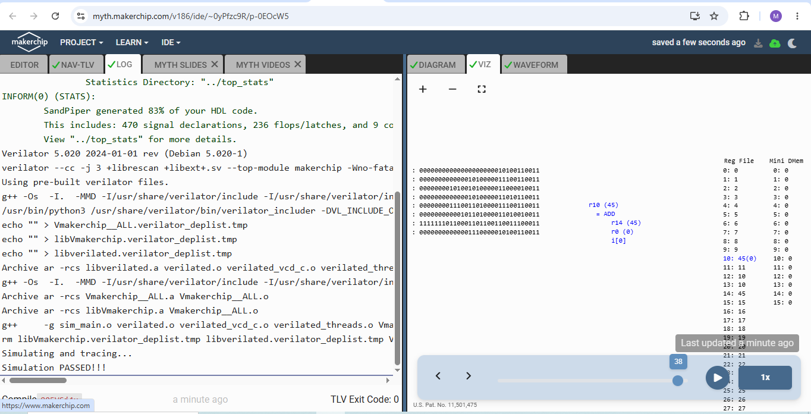

---


