## Pipelining RISC-V

The processor begins moving from a sequential design toward a pipelined design. Work is divided into stages so that multiple instructions can be processed at the same time. Instead of completing one instruction fully before starting the next, several instructions occupy different stages of the processor simultaneously.

A waterfall diagram is used to visualize how instructions move through the pipeline.

**Example:**

```text
Instruction 1:  P D R E W
Instruction 2:    P D R E W
Instruction 3:      P D R E W
Instruction 4:        P D R E W
```

Where:

- **P** = Program Counter / instruction fetch
- **D** = Decode
- **R** = Register File Read
- **E** = Execute / ALU
- **W** = Register File Write

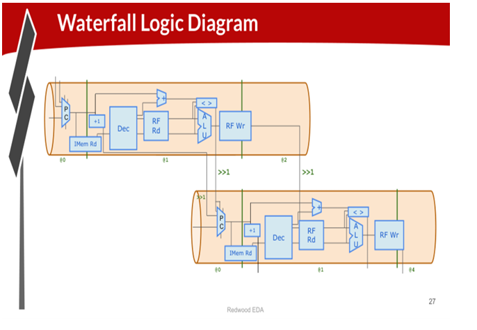

Multiple instructions are therefore being processed simultaneously.

---

## Pipeline Hazards

Pipelining introduces hazards when instructions depend on one another.

For example:

```asm
addi a3, a3, 1
add  a4, a3, a4
```

The second instruction needs the value of `a3` produced by the first instruction. However, the first instruction may not have written the value back to the register file yet. This creates an **inter-instruction dependency**.

These dependencies can be addressed using pipeline alignment and register-file bypassing.

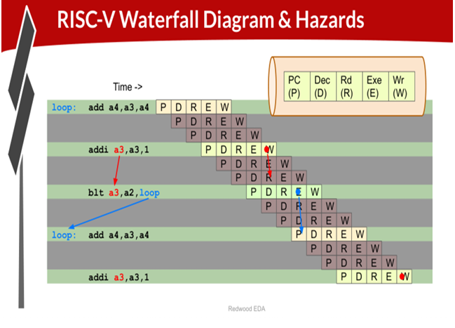

---

## Register File Bypass

Register-file bypassing allows a newly calculated result to be used directly by a following instruction, instead of waiting for the normal register-file write/read sequence.

The source register value can select the previous `$result` when:

- The previous instruction writes to the register file
- The previous destination register matches the current source register

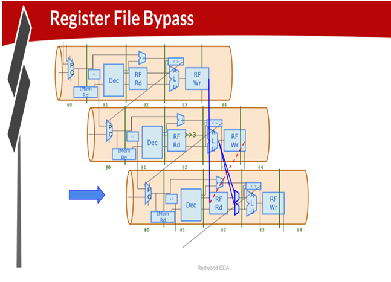

---

## Three-Cycle `$valid`

Once the processor is pipelined, not every instruction occupying a pipeline stage is necessarily valid.

A `$valid` signal is used to identify whether the instruction currently being processed should have an effect. A `$start` signal is used to generate the initial valid pulse after reset. The `$valid` signal is then propagated through the pipeline.

This becomes especially important for instructions that redirect control flow, such as branches and jumps.

---

## Three-Cycle RISC-V

The processor is then updated to operate correctly with the three-cycle pipeline.

Invalid instructions must not:

- Write to the register file
- Incorrectly redirect the PC

For branches, the following is used:

```tlverilog
$valid_taken_br = $valid && $taken_br;
```

This ensures that only a valid taken branch can redirect the PC.

---

## Branches

A branch changes the normal sequential flow of execution when its condition is satisfied.

For example:

```text
if condition is true:
    PC = branch target
else:
    PC = next instruction
```

The branch target is calculated separately from the normal incremented PC.

Because instructions are already in the pipeline when a branch is resolved, instructions following a taken branch may need to be invalidated. These instructions are commonly referred to as being in the **branch's shadow**.

The `$valid` logic is therefore updated to prevent invalid instructions from affecting processor state.

---

## Complete Instruction Decode

The instruction decoder is expanded to support the remaining RV32I instructions.

Individual instruction signals such as `$is_add`, `$is_sub`, `$is_jal`, `$is_jalr`, and others are then generated from the decoded bits.

The instruction type is identified using fields such as:

- `funct7`
- `funct3`
- `opcode`

These fields are combined into:

```tlverilog
$dec_bits[10:0] = {$funct7[5], $funct3, $opcode};
```

Loads are treated as one instruction category at this stage.

---

## Complete ALU

The ALU is extended to support the remaining RV32I operations. The `$result` signal selects the appropriate operation based on the decoded instruction.

**Operations covered include:**

**Immediate operations**

- `ANDI`
- `ORI`
- `XORI`
- `ADDI`
- `SLLI`
- `SRLI`
- `SRAI`
- `SLTI`
- `SLTIU`

**Register operations**

- `AND`
- `OR`
- `XOR`
- `ADD`
- `SUB`
- `SLL`
- `SRL`
- `SRA`
- `SLT`
- `SLTU`

**Other operations**

- `LUI`
- `AUIPC`
- `JAL`
- `JALR`

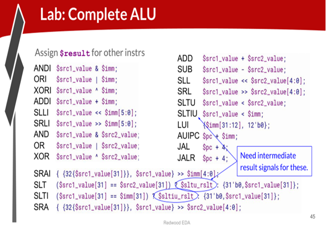

---

## Loads and Stores

The processor is extended to communicate with data memory.

### Load

A load reads data from memory:

```asm
LOAD rd, imm(rs1)
```

Conceptually:

```text
address = rs1 + immediate
rd = DMem[address]
```

### Store

A store writes register data to memory:

```asm
STORE rs2, imm(rs1)
```

Conceptually:

```text
address = rs1 + immediate
DMem[address] = rs2
```

---

## Load Redirect

Loads introduce another pipeline timing problem. The load instruction occupies multiple pipeline stages before its memory result becomes available.

Therefore, invalidate instructions in the load's shadow, similar to branch handling. The PC is also redirected using the appropriately delayed `$inc_pc`.

This prevents instructions from being incorrectly executed while the load is being handled.

---

## Load Data

The load result comes from data memory rather than directly from the ALU. The processor therefore needs a path for:

```text
DMem → $ld_data → Register File
```

The register-file write-data MUX selects the appropriate value depending on whether the instruction is a normal ALU instruction or a load.

---

## Data Memory

The workshop adds a small data memory of 16 entries, with 32 bits per entry.

The DMem interface contains signals for:

```tlverilog
$dmem_wr_en
$dmem_addr
$dmem_wr_data
$dmem_rd_en
$dmem_rd_data
```

The memory address uses:

```tlverilog
$address[5:2]
```

to select the memory entry.

The test program is modified to verify that the processor can store and retrieve data from DMem. The final result is stored at byte address 16:

```tlverilog
m4_asm(SW, r0, r10, 10000)
```

It is then loaded into `x17`:

```tlverilog
m4_asm(LW, r17, r0, 10000)
```

The passing condition checks `x17`.

For the test program:

```text
1 + 2 + 3 + 4 + 5 + 6 + 7 + 8 + 9 = 45
```

Therefore the expected result is:

```text
DMem[16] = 45
x17 = 45
```

---

## Jumps

### JAL

`JAL` jumps to:

```text
PC + immediate
```

It is similar to an unconditional branch, so the branch target can be used:

```tlverilog
$br_tgt_pc
```

### JALR

`JALR` jumps to:

```text
rs1 + immediate
```

The target is calculated using:

```tlverilog
$jalr_tgt_pc[31:0] = $src1_value + $imm;
```

---

## Labs

### 3-Cycle `$valid`

The processor was converted to use a 3-cycle valid pipeline.

A `$start` signal was created to generate the first `$valid` pulse after reset. `$valid` was then propagated through the pipeline using `>>3$valid`.

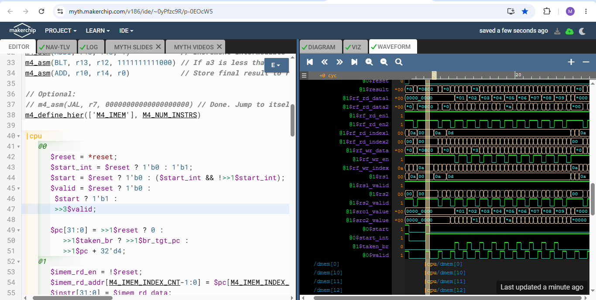

### 3-Cycle RISC-V

This lab has four goals:

- Prevent invalid instructions from writing the RF
- Prevent invalid branches from redirecting the PC
- Introduce `$valid_taken_br`
- Update the inter-instruction dependencies with `>>3`

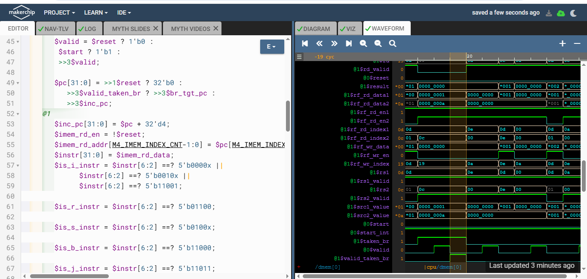

### 3-Cycle RISC-V — Pipeline Partitioning

Partition the logic into pipeline stages; the `>>2` alignment is appropriate because the preceding two instructions do not update the RF.

The intended structure is as follows:

```text
@0  → PC
       ↓
@1  → Instruction fetch + decode
       ↓
@2  → Register File Read
       ↓
@3  → ALU + Branch + Register File Write
       ↓
@4  → Visualization
```

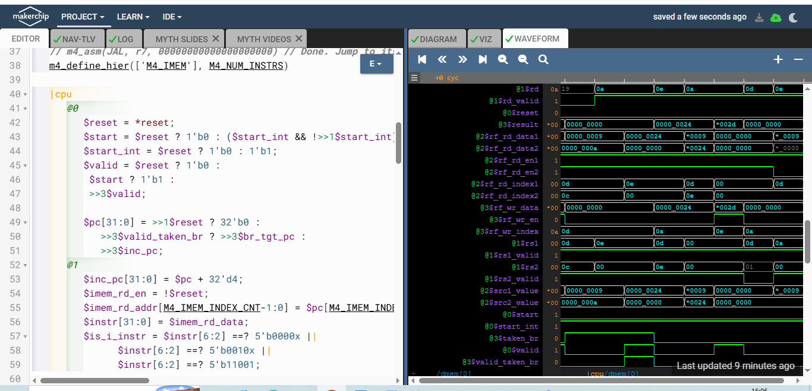

### Register File Bypass

Register-file bypassing was added to handle dependencies between consecutive instructions. The source register values were updated to select the previous ALU result when the previous instruction writes to the same register being read.

### Branches

Branch handling was updated for the pipelined processor.

`$valid` was moved to `@3` and made dependent on the absence of valid taken branches in the previous two instructions. The PC was also changed to increment every cycle, while branch redirection remained a 3-cycle operation.

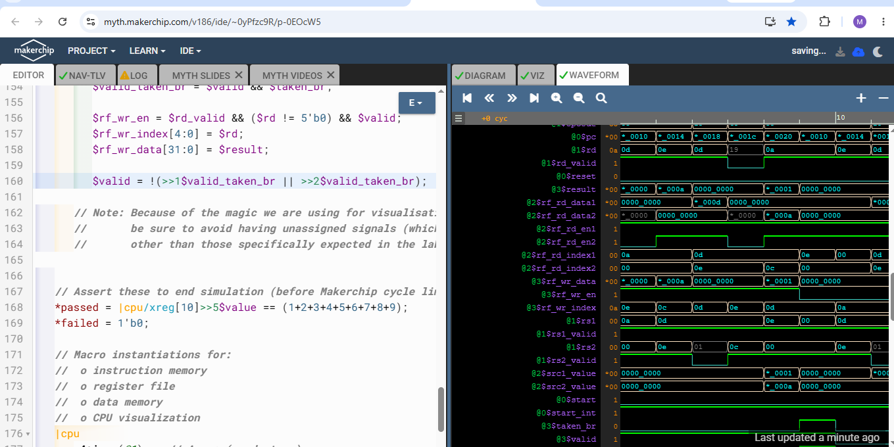

### Complete Instruction Decode

The remaining RV32I instruction decode signals were completed, excluding loads. Loads were treated as a single instruction category, using the opcode to generate `$is_load`.

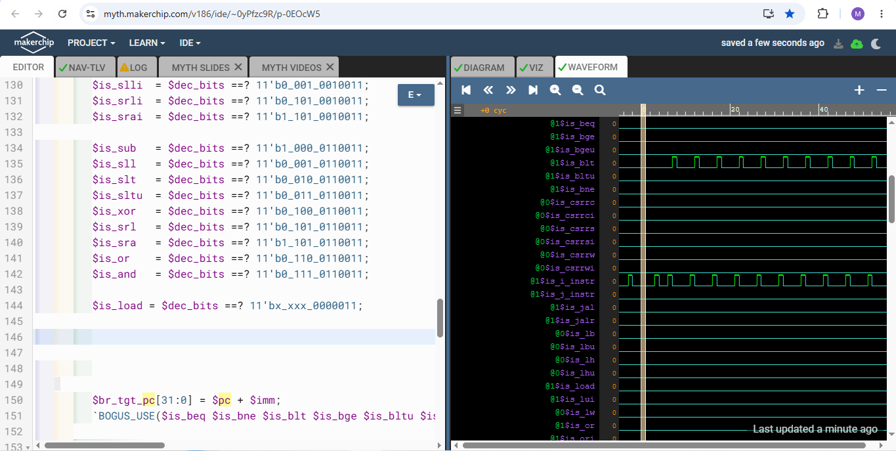

### Complete ALU

The ALU was extended to generate `$result` for the remaining RV32I instructions. Intermediate result signals were added where required.

### Load Data

Load instructions were given redirect handling similar to branches.

`$valid` was cleared in the shadow of a load, and the PC was redirected using `$inc_pc` from three instructions earlier. Load/store instructions were made to use the same address calculation as `ADDI`.

A register-file write-data MUX was added to select delayed load data and destination register information for invalid pipeline instructions. Load data was written back two instructions after a valid load.

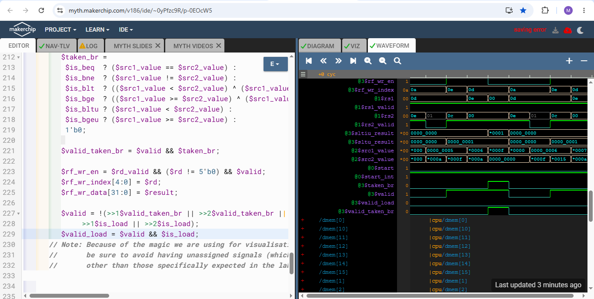

### DMem

The data memory was enabled and connected to the processor.

The DMem interface uses address bits `[5:2]` for the memory address, with separate controls for read and write operations.

### Load/Store in Program

The test program was modified to store the final result to byte address `16` and then load it into `x17`.

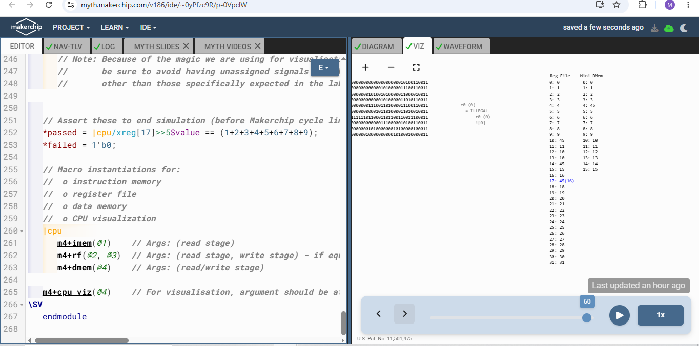
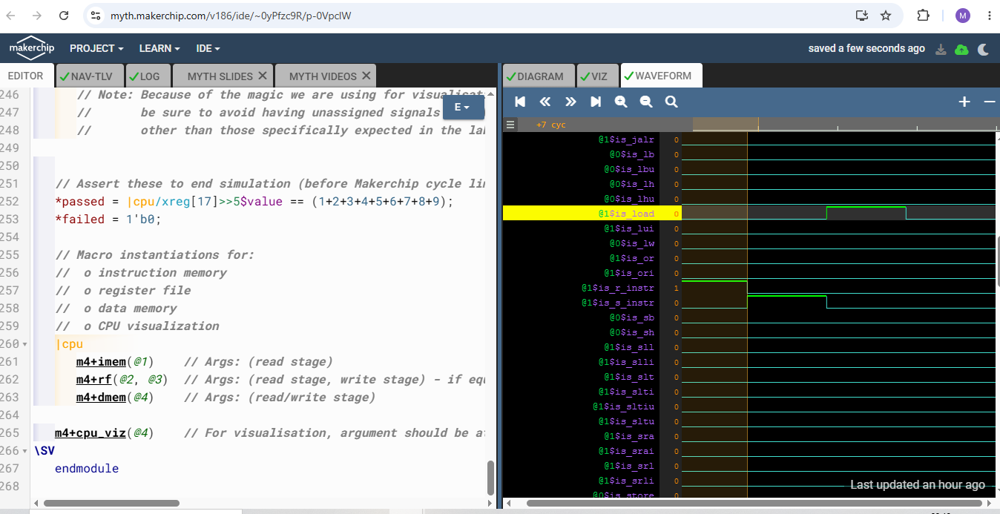

### Jumps

Jump support was added for the RISC-V `JAL` and `JALR` instructions.

- `$is_jump` was defined
- Jump instructions were given invalid shadow cycles using `$valid_jump`
- `$jalr_tgt_pc` was calculated
- PC selection for JAL/JALR was updated so that `JAL` uses `>>3$br_tgt_pc` and `JALR` uses `>>3$jalr_tgt_pc`

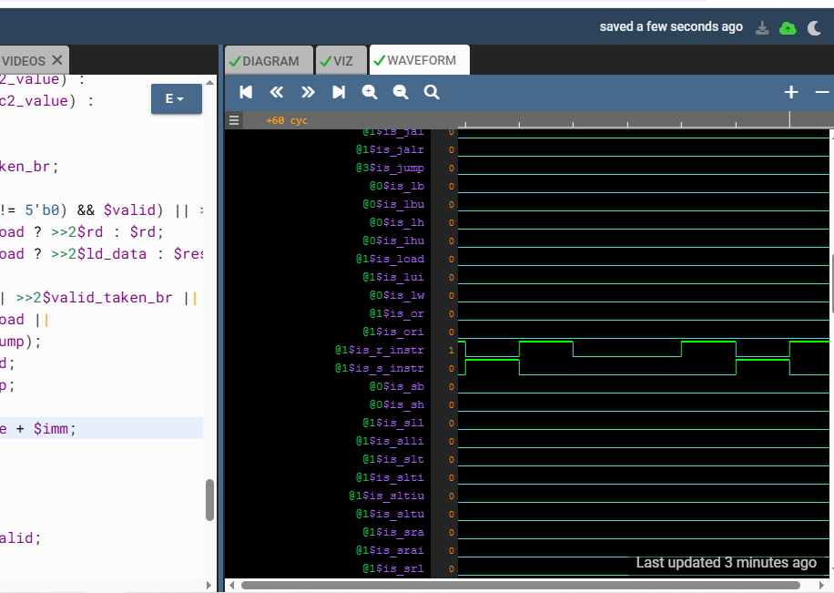
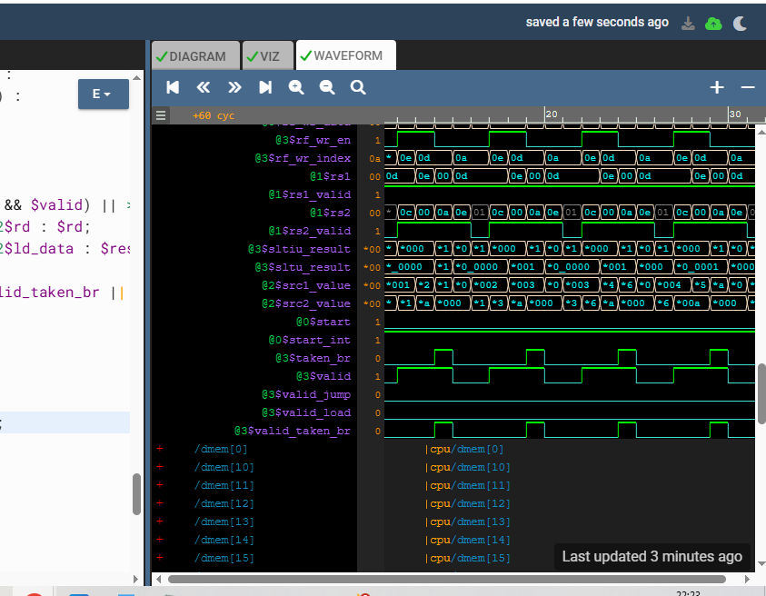
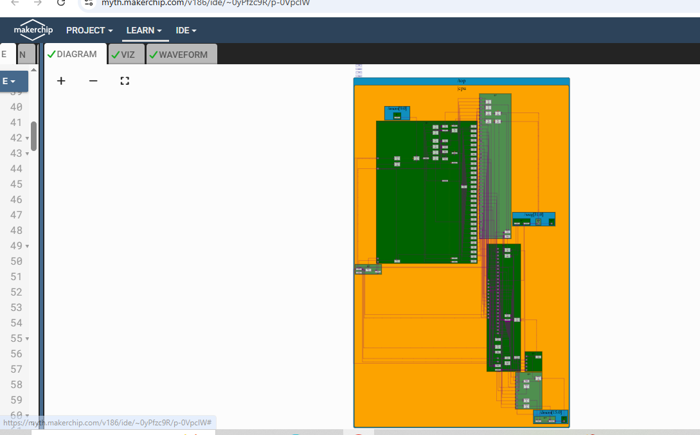
 
---

**Final Makerchip Link:** https://myth.makerchip.com/v186/ide/~0yPfzc9R/p-0VpclW
